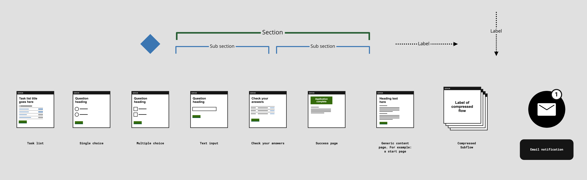
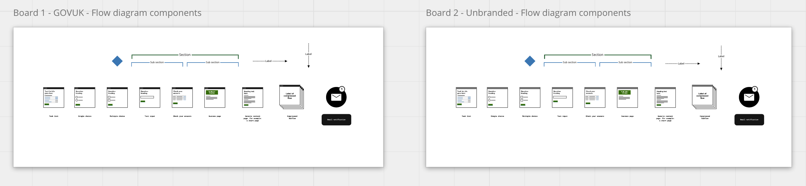
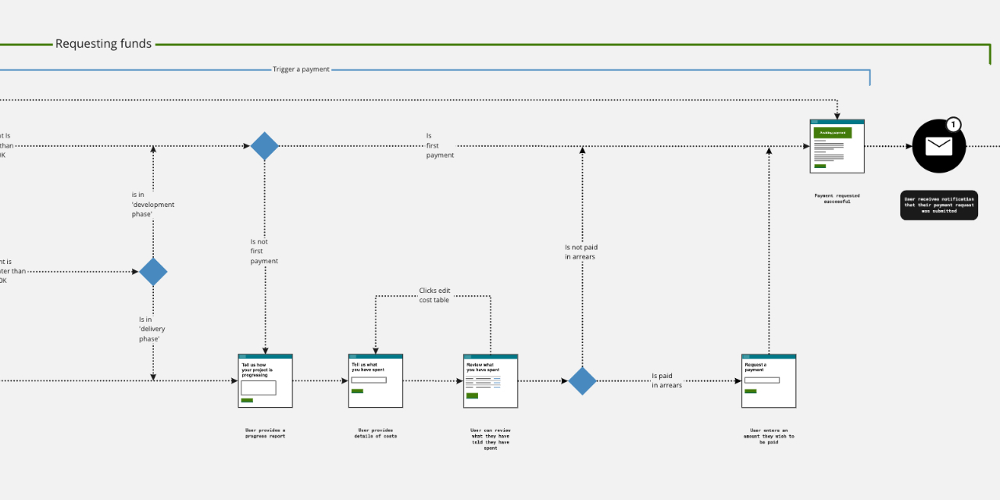

## **Note - 27th Jan 2023** 

There is currently an issue with the [public Miro board](https://miro.com/app/board/o9J_ldS3wF8=/) preventing people from copying the assets. I'm working on a solution.

---

# GOVUK Design System Flow Diagrams for Miro
A [Miro version](https://miro.com/app/board/o9J_ldS3wF8=/) of a popular [GOVUK Design System](https://gov.uk/design-system) based flow diagram developed by the GOVDESIGN community.

## If you use a free Miro account

### Instructions to copy to your own Miro board

1. Create a new Miro board or open an existing one that you would like to add these flow diagram components to
2. In a new tab or window go to the publically accessible version of the [GOVUK Design System Flow Diagram for Miro](https://miro.com/app/board/o9J_ldS3wF8=/)
3. Find the following frames:

4. Select all the flow components (CMD/CTRL + A)
5. Copy them to your clipboard (Press CMD/CTRL + C)
6. Switch back to your Miro in the other window or tab
7. Paste the components into your board (CMD/CTRL + V)
8. Done!

## If you have a paid Miro account

### Instructions to download a copy to add to your Miro account

1. In this repository download the file '[GOVUK Flow Diagram Components.rtb](GOVUK%20Flow%20Diagram%20Components.rtb)'. 
2. Go to your Miro account.
3. Find the 'upload from backup' option.
4. Locate the file you downloaded in step 1 (GOVUK Flow Diagram Components.rtb) and choose it.
5. File will upload
6. Done! A new Miro board based on this file will be created.

Use this file in Miro to create flow diagrams of GOV.UK services or Unbranded services that are based on the GOVUK Design System.

## Example usage

## See version in Miro

[View this file in Miro](https://miro.com/app/board/o9J_ldS3wF8=/)

## Credit

Credit to Dave House who's [Sketch version](https://github.com/dashouse/govuk-design-system-flow-diagrams) inspired this Miro version and all the other contributors to the GOVUK Design System.
